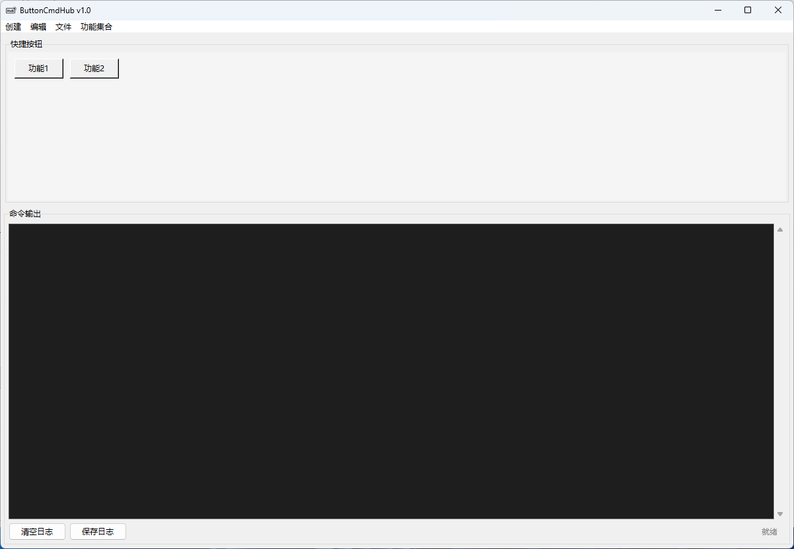
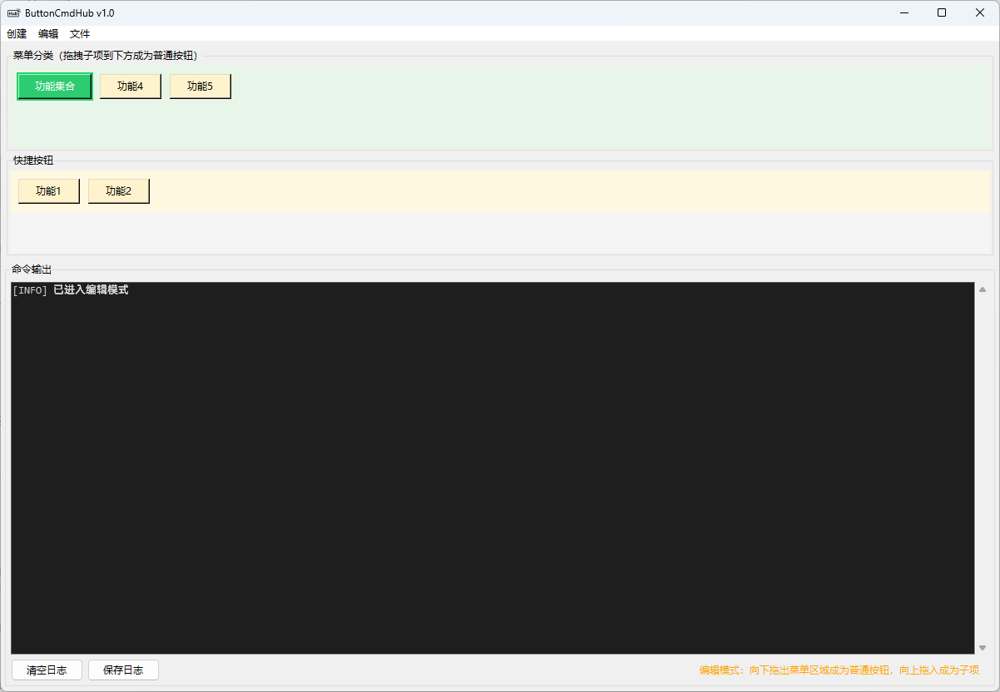
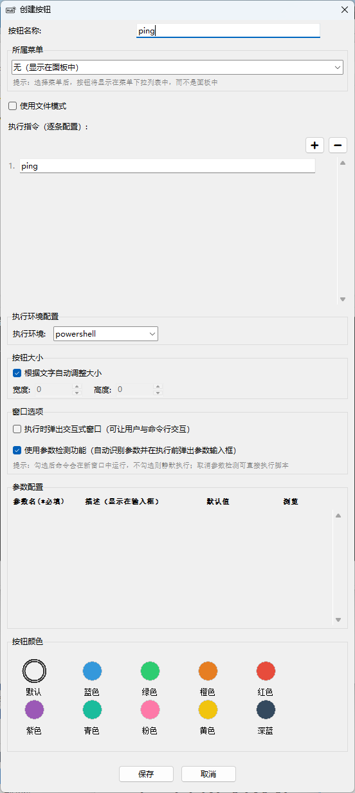

# ButtonCmdHub

把繁琐的命令行操作，变成一键点击。

ButtonCmdHub 是一款为 Windows 设计的命令快捷启动工具。它能将你日常重复使用的脚本、命令整理成可视化的按钮面板，告别复制粘贴，告别记忆冗长指令。

## 它能帮你做什么

**开发者场景**
- 一键启动项目：自动执行 `git pull` → `npm install` → `npm run dev`
- 快速部署：打包脚本、上传命令、环境切换，一个按钮完成
- 批量处理：重复性的文件操作、数据转换任务

**运维/管理员场景**
- 系统巡检：把常用检查命令保存为按钮，定期执行
- 服务管理：启动/停止/重启服务的快捷入口
- 日志查看：快速打开常用日志文件或执行分析脚本

**个人效率**
- 整理零散工具：把散落在各处的 `.bat`、`.ps1` 脚本统一管理
- 定时任务替代：不需要 Windows 计划任务，点击即运行
- 团队协作：导出配置分享给同事，保持工作流一致

## 主要功能

### 可视化按钮面板
- 自由创建按钮，自定义名称、颜色、大小
- 拖拽调整位置，按你的工作习惯排布
- 支持分组菜单，按钮多也不乱

### 智能脚本支持
- **一键导入**：从 `.ps1` / `.bat` / `.cmd` / `.sh` 文件直接创建按钮
- **自动识别**：智能提取脚本中的参数，执行前弹出输入框
- **参数化交互**：一次配置后，再也不用翻查代码确认参数含义，通过友好的UI界面输入参数值，支持通过资源管理器选择方式填入目录或者文件绝对路径，大幅降低使用门槛
- **多环境兼容**：支持 PowerShell、CMD、Python、WSL 四种执行方式
- **Python 版本选择**：自动扫描系统中安装的 Python 版本（包括 Conda），执行 Python 脚本时可选择特定版本，默认自动匹配最合适的解释器

### 灵活执行方式
- **静默执行**：不弹出控制台窗口，在后台完成执行，适合无需查看输出的自动化任务
- **交互窗口**：弹出控制台，方便查看实时日志、调试信息，或进行命令行交互输入
- **工作目录**：自动识别脚本所在位置，避免路径问题

### 配置随身带走
- 所有设置自动保存，换电脑也不怕
- 支持导入导出，轻松分享给团队成员
- 配置重置功能，一键回到初始状态

### AI 友好设计
把 AI 编写的海量脚本，全都可以保存下来，作为己用重复执行，节省 token。由于完全采用配置文件驱动，也可以让 AI 帮忙生成配置文件，直接省去自己手动创建的麻烦。

## 界面展示

### 主界面


### 编辑模式


### 按钮配置


## 使用前准备

ButtonCmdHub 面向有一定命令行基础的用户。使用前请确认：

- 你熟悉 Windows 命令行操作（PowerShell 或 CMD）
- 你有一些需要重复执行的脚本或命令
- 你的电脑运行 Windows 10/11（暂不支持 Mac/Linux）

## 快速上手

### 1. 创建第一个按钮
点击顶部菜单「创建」→「按钮」，填写：
- **按钮名称**：如"启动开发服务器"
- **执行命令**：如 `npm run dev`
- **运行方式**：选择 CMD 或 PowerShell

保存后，点击按钮即可执行。

### 2. 导入已有脚本
如果你有现成的脚本文件：
1. 编辑按钮 → 点击「从文件导入脚本」
2. 选择 `.ps1`、`.bat`、`.cmd` 或 `.sh` 文件
3. 工具会自动提取脚本内容，并识别需要输入的参数
4. 保存后执行，会自动弹出参数输入框

### 3. 使用参数功能（进阶）
在脚本中定义参数后，工具会自动识别并以 **UI 输入框** 的形式呈现，一目了然，支持默认参数自动填充。

**如何使用**：在脚本中按规范定义参数（详见[参数定义建议](#参数定义建议)），保存后点击按钮即弹出参数输入对话框。

**支持功能**：
- 自动识别脚本中的参数（位置参数、命名变量）
- UI 输入框展示，清晰直观
- 默认参数值自动填充
- 支持文件/文件夹浏览选择

### 4. 整理按钮
- 拖拽按钮调整位置
- 创建菜单，把相关按钮归类到一起
- 编辑模式下可以批量调整

## 注意事项

1. **WSL 支持**：如需在 WSL 中执行命令，请先在 Windows 中安装并配置好 WSL
2. **编码问题**：导入的中文脚本如出现乱码，工具会自动尝试修复，建议统一使用 UTF-8 编码保存脚本
3. **参数检测**：复杂的脚本可能无法自动识别参数，此时可以关闭「使用参数检测功能」，让脚本直接执行
4. **权限问题**：某些系统命令需要管理员权限，请确保脚本本身有相应的权限处理

### 关于项目虚拟环境（.venv）的使用

ButtonCmdHub 主要支持**系统级 Python** 和 **Conda base 环境**。对于使用项目本地虚拟环境（如 `.venv`、`venv`）的情况：

**推荐做法**：创建一个启动批处理文件

```batch
@echo off
cd /d "项目路径"
call ".venv\Scripts\activate.bat"
python your_script.py
```

然后在 ButtonCmdHub 中：
- 环境选择 **CMD** 或 **PowerShell**
- 命令填写批处理文件路径

### 脚本编写规范（重要）

工具将脚本复制到临时目录执行，以下语法会返回 Temp 路径而非工作目录：

| 脚本类型 | 避免使用 | 改用 |
|---------|---------|------|
| **PowerShell** | `$MyInvocation.MyCommand.Path`<br>`$PSScriptRoot` | `(Get-Location).Path` / `$PWD` |
| **CMD/BAT** | `%~dp0` / `%~nx0` / `%~f0` / `%0` | 相对路径或工作目录配置 |
| **Python** | `__file__` | `os.getcwd()` |
| **Shell** | `$0` / `$(dirname "$0")` / `$(basename "$0")`<br>`$(readlink -f "$0")` / `${0##*/}` | `$(pwd)` / `$PWD` |

#### 参数定义建议

各脚本类型定义参数的方式：

```powershell
# PowerShell
param(
    [string]$项目名称 = "my-app",
    [int]$端口号 = 3000
)
```

```bash
# Shell - 位置参数带默认值
PROJECT_NAME="${1:-my-app}"
PORT="${2:-3000}"

# Shell - 命名变量带默认值
CONFIG_FILE="${CONFIG_FILE:-config.txt}"
```

```python
# Python - 使用 argparse
parser.add_argument('--port', '-p', default=3000, type=int)
```

#### 常见问题

1. **参数误识别**：脚本内部变量可能被识别为参数，可关闭「使用参数检测功能」或忽略
2. **Shell 命名变量**：需设置默认值 `${var:-default}`，否则保存时可能提示修改
3. **工作目录**：在按钮配置中设置，脚本中使用相对路径即可

## 安全与责任声明

**ButtonCmdHub 仅提供脚本执行环境和管理辅助功能，不干预、不审查脚本内容。**

- **脚本责任自负**：所有通过本软件执行的脚本和命令，其后果由使用者自行承担。请在配置按钮前确认脚本来源可信、内容安全。
- **谨慎操作**：执行涉及文件删除、覆盖、系统修改的脚本时，请务必仔细检查配置，建议在执行前进行测试。
- **特别注意**：如果脚本涉及批量覆盖输出目录，请务必确认最终路径是否正确，避免误删重要文件。**强烈建议定期备份数据和脚本。**

## 系统要求

- Windows 10 或 Windows 11
- 部分功能需要预装 PowerShell 或 WSL（可选）

## 数据备份

所有按钮设置保存在同目录下的 `ui_layout.json` 文件中，建议定期备份此文件以便迁移或恢复。

## License

Copyright (c) 2026
